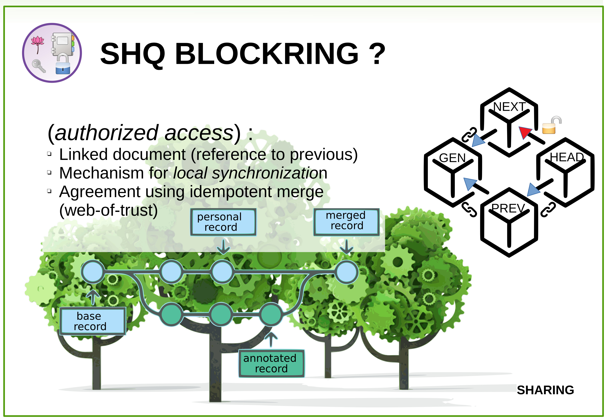

![QRC]
### blockRing™

you probably arrived here with this [QRcode][QRC] :

[QRC]: https://chart.googleapis.com/chart?cht=qr&choe=UTF-8&chld=L&chs=180&chl=https://shqb.ml/bring

Thank you for visiting the blockRing page for [Self Health Quantification][1]


### My contact information : 

 * email: [m.combes@gc-bank.org](mailto:m.combes@gc-bank.org)
 * phone: [+41 76 689 4880](callto:+41766894880)

 * vCard: [michel.vcf](../hCard/vCard.vcf)


{{ contact | markdownify }}

<!-- 
 
 -->

#### What is a blockRing ?

 * It is a blockChain (an ecofriendly one : no mining)

   1. linked "blocks" (data record)
   2. distribution network
   3. rule and means for publishing update (at global scale)

 * the last block (*HEAD*) is linked to placeholder block (*NEXT*) using "signed" link.
  the next block is mutable this means that its contant can be updated by its owner
  and this block is linked back to the first block (*GENESIS*) closing the loop.

 

Conventional blockchain are linear chains, there are open ended, making it hard for a user to verify
which version is accurate, when a chain is "closed" with a signed lock*pad*, only the last owner can
add block to the chain.

You may wonder why *block*Chain, as compared to conventional database ?

check out our [video](//youtube.com/embed/IhwXt-LjogY) below (in French) 
<iframe width="560" height="315" src="https://www.youtube.com/embed/IhwXt-LjogY" frameborder="0" allow="accelerometer; autoplay; encrypted-media; gyroscope; picture-in-picture" allowfullscreen>https://www.youtube.com/embed/IhwXt-LjogY</iframe>

<!-- 
 
 -->

## Why *block*chain ?

* allow health continuity, access anytime, anywhere

* blockchain: open data, borders agnostic
* blockchain: linked data == knowledge sharing, beyond-information, data intelligence
* blockchain: chained links provide security / integrity
* blockchain: distributed translated to easy accessibility
* blockchain: decentralized : resilience
* blockchain: tracability (travelling back the foodchain)
* blockchain: discoverable (no wall guarded garden)

* blockchain: integrative uniform access, AI enabled for ML
* blockchain: easy to deploy
* blockchain: resistance to manipulation

* have a plurality of side benefits
  (permanent, log trail, versionning, privacy, concensus, discoverable)

* *block*Chain is omnipresent is modern system ...

### Allow for:

* consumer apps to be accessible for research
* self reporting, easy capture
* reducing friction: connected sensors, wearable etc.

[1]: {{site.search}}=!g+Self+Health+Quantification+blockchain+OR+blockRing™
