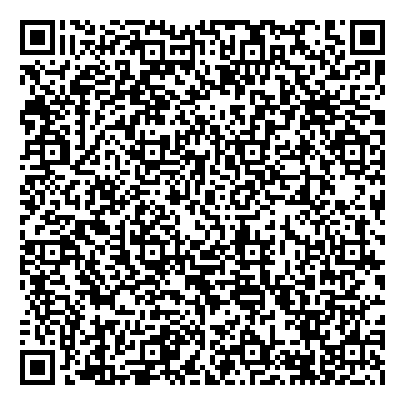

<meta http-equiv="refresh" content="300;URL=home.htm"/>

# {{page.title}} 

We believe in the wisdom gained with sharing our health data,
still remaining secure and preserving everyone privacy.

*block*chain can be a very nice way to deploy the infrastructure
require for a global health research to improve personal health.

And selfquantification data is at the fuel for advancement.

### Self Quantification *block*Chain 

read our [abstract](home.htm) <abstract.txt>

## Why *block*chain ?

* allow health continuity, access anytime, anywhere

* blockchain: open data, borders agnostic
* blockchain: chained links provide security / integrity
* blockchain: distributed translated to easy accessibility
* blockchain: decentralized : resilience
* blockchain: tracability
* blockchain: discoverable (no wall guarded garden)

* blockchain: integrative uniform access, AI enabled
* blockchain: easy to deploy
* blockchain: resistance to manipulation

* have a plurality of side benefits
  (permanent,log trail,versionning,privacy,concensus,discoverable) 

* *block*Chain is omnipresent is modern system ...

### Allow for:

* apps consumer not accessible for research
* self reporting, manual data capture, (myfood24)
* digital imaging
* reduce friction: sensors, wearable
* ML, validation,
* vision based : volume, 2 shots + 3D reconstitution 

## Miscelleaneous links

-  my [hCard](hCard/hCard.htm)[*]
-  a [README](README.html) file,
-  a [frama](frama.htm) page and
-  a [landing](landing.htm) one.
-  a [newsletter](newsletter.htm),
-  a few [links](links.html),

[*]: http://ifps.io/ipns/{{site.data.hcard.mkey}}/hCard.htm

 



<!--
sustable: compiled metrics
ref. Gzaon et al. Food Chemistry 2018

math-optimized food diet
Perignon, Pub health Nutr. 2016
Vieux Eur J Clin Nutr. 2017

bioviability equation

connect w/ cooks and recipes makers

non-nutriment compenent to optimize for special diet in response to disease

"once we have the data" we can !

Dietary assessment (INRA ClermontFerrand)
6000000 product in France ... 30000 food compounds etc///
nutrition.org
self reporting -> error, missing info etc... lack of accuracy and coverage
 ( recall bias )

DB: 
fooddb.ca, phytoHub

altertas: bio transformer : simulate possible metabolites you may find after intake of any chemical moleculs

foodball consortiom:
exposome explorer
foodmetabolome.org
-->

